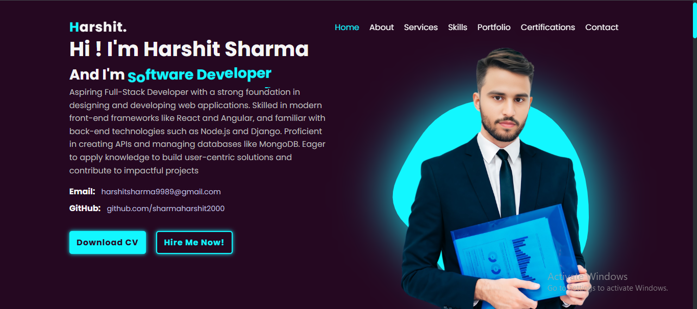

# 🧑‍💻 Personal Portfolio Website

A modern, responsive **portfolio website** to showcase my **projects**, **skills**, and **certifications**. Built using HTML, CSS, and JavaScript — this site reflects my personal branding and professional journey as a developer.

---

## 🚀 Live Demo

- 👉 [Visit the Portfolio Website](https://portfolios-personals.netlify.app/)
- 📦 [GitHub Repository](https://github.com/sharmaHarshit2000/Portfolio-Website)
- 🧾 [Resume (PDF)](./resume/HarshitSharma_InternshalaResume.pdf) <!-- Update filename if needed -->

---

## 📌 Features

- 🎯 Clean and modern UI
- 🧠 List of skills and tech stack
- 🧾 Certifications section
- 🧳 Resume download/view
- 🧩 Smooth scrolling and interactivity
- 📱 Fully responsive for all devices

---

## 🛠️ Tech Stack

- **HTML5** – Semantic structure
- **CSS3** – Responsive layout and animations
- **JavaScript (Vanilla)** – DOM interactions and dynamic content

---

## 📂 Project Structure

```
Portfolio-Website/
│
├── certifications/
├── img/
├── resume/
│
├── index.html
├── script.js
├── styles.css
└── readme.md
```

---

## 🌐 How to Use

1. **Clone the repository:**
   ```bash
   git clone https://github.com/sharmaHarshit2000/Portfolio-Website.git
   ```
2. **Open in browser:**  
   No server setup required. Simply open `index.html` in your browser.

3. **Customize:**
   - Replace dummy images and text under `img/` and `certifications/`.
   - Add or update your resume PDF under `resume/`.
   - Edit HTML sections to reflect your real projects and skills.

---

## 🖼️ Screenshots



---

> This is my portfolio website.  
> [Live Demo](https://portfolios-personals.netlify.app/) | [GitHub](https://github.com/sharmaHarshit2000/Portfolio-Website)
